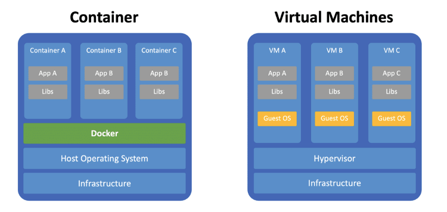

## SQL 기본기

### HDD/SSD, RAM

- HDD/SSD는 저장장치. 코드가 저장되는 공간 등
- RAM은 코드가 실행 되는 공간. 실행 도중 생성된 값들은 영구 저장이 되지 않는다.
- RAM을 사용하는 이유는 속도가 빠르기 때문

### Structured Queyry Language

- 데이터를 영구적으로 저장하기 위해선 HDD/SSD에 데이터를 저장해야한다.
- 가장 흔하게 사용하는 방법이 SQL을 사용하는것
- SQL은 table로 구성되어 있다.
- row(행), column(열)로 구성되어 있고 select, update, delete, insert 작업을 할 수 있다.

## Docker

- 멀티 플랫폼 등 실행 환경이 달라 문제가 되는 걸 Dockerfile을 작성해서 해결할 수 있음
- 예를들어 어떤 프로젝트를 실행하기 위해선 여러 설치 과정이 필요한데 이걸 하나의 파일에 명세 처럼 작성하여(Dockerfile) 모든 사람이 동일한 환경에서 실행 할 수 있도록 도와주는게 Docker

### docker 구성

- 기존의 가상화 기술은 하이퍼바이저를 이용하여 Guest OS를 설치하고 그 위에 어플리케이션을 올리는 구조였습니다.
- Docker는 LXC(Linux Container)를 기반으로 OS를 마치 프로세스단위로 격리하여 사용합니다.
- 도커는 특정 프로그램을 하나의 컨테이너로 dockerfile을 이용해 묶어서 같은 환경(조건)에서 똑같이 실행되도록 하게 해주는 도구

## Docker compose
